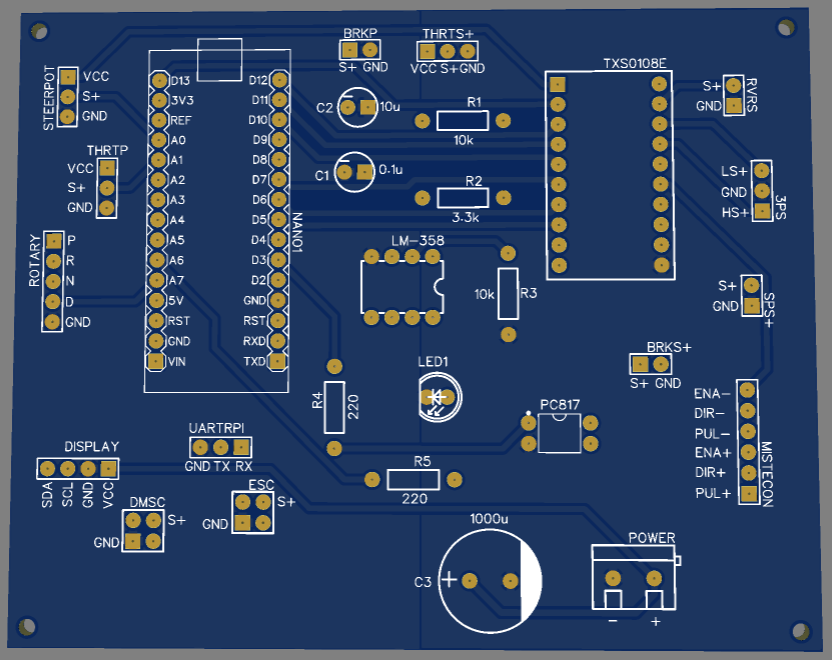
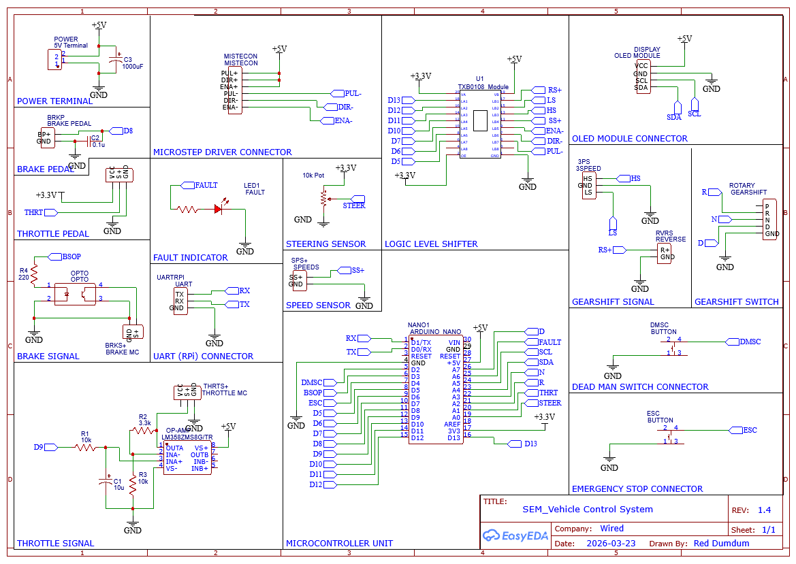
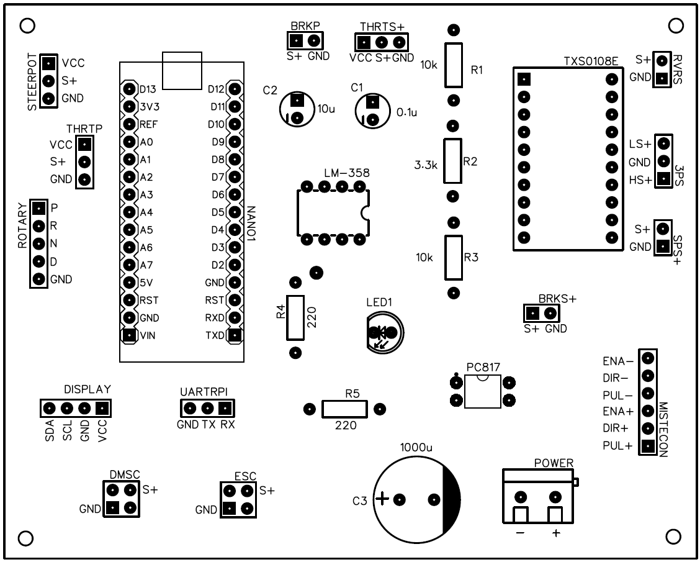
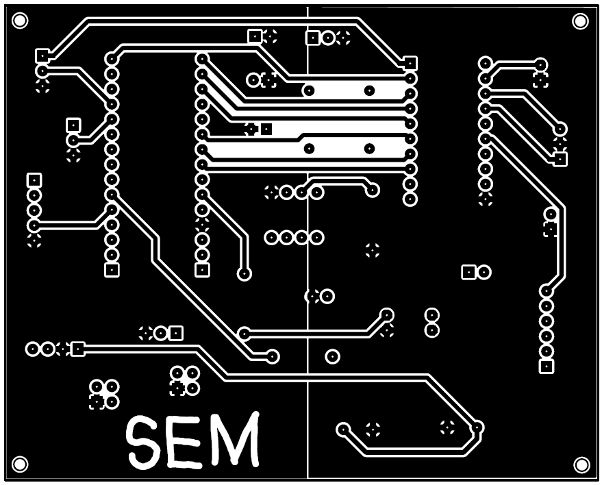
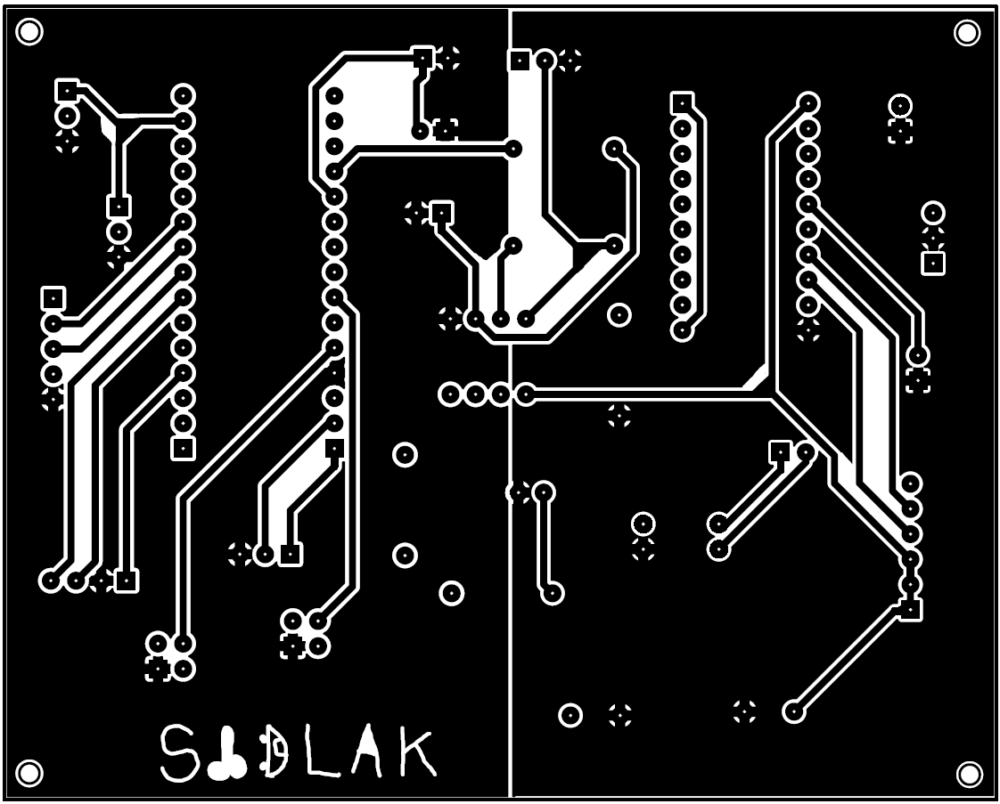

# 🏎️ VCS: Vehicle Control System (Shell Eco-marathon Edition)

The **Vehicle Control System (VCS)** is a high-reliability, RTOS-driven control architecture designed for the **Shell Eco-marathon (SEM)**. It serves as the deterministic bridge between high-level autonomous navigation (Raspberry Pi) and high-power execution (1500W BLDC Motor & Stepper Steering).

## 🤖 AI Collaboration
This system was architected and refined in collaboration with **Gemini 3.1 Pro**. Key focus areas included:
* **Hardware Security & PCB Design:** Engineering a custom 100x100mm dual-layer PCB featuring strict galvanic isolation, dual ground planes, and an optocoupler "moat" to protect 3.3V logic from 60V motor noise.
* **Mbed OS Integration:** Transitioning to a multi-threaded architecture on the Arduino Nano 33 BLE.
* **Safety Engineering:** Implementing a Hardware Watchdog, CRC16 checksums, and prioritized interrupt-based overrides.
* **Digital Twin:** A HIL (Hardware-in-the-Loop) simulation module for lab-testing logic without high-voltage power.

---

## 🚀 Version History

### **v1.4 (Current - Custom PCB & Galvanic Isolation)**
*The "Hardware Security" release. Focuses on migrating from loose wire prototypes to a professional, noise-immune physical board.*
* **Custom PCB:** 100x80mm form factor with dedicated terminal blocks for perimeter harness wiring.
* **Analog Signal Conditioning:** On-board LM358 Op-Amp and RC filtering (`C1`, `C2`) for clean, hardware-smoothed throttle output.
* **5V Logic Translation:** Dedicated TXS0108E level-shifting IC for reliable communication with the stepper driver and peripherals.

### **v1.3 (Legacy - Mbed OS & Reliability)**
*The "RTOS" release. Focused on deterministic timing.*
* **Mbed OS Threads:** 1kHz Control Loop, 100Hz Comm/Safety Loop, and 20Hz UI/Telemetry Loop.
* **Hardware Watchdog:** Integrated nRF52840 watchdog (2s timeout) for SEM technical compliance.

### **v1.2 & v1.1 (Legacy - ESP32/STM32)**
*Focus on steering precision and initial modular isolation.*
* **Stepper Steering:** High-torque microstepping replaced legacy DC motor steering.

---

## 🛡️ SIDLAK Safety Architecture
The VCS enforces a strict priority hierarchy. Motor power is physically impossible unless the system evaluates all safety conditions as "Clear."

| State | SEM Requirement | Description |
| :--- | :--- | :--- |
| **INIT** | Self-Test | Boot sequence, optocoupler lockout, and hardware health check. |
| **IDLE** | Safety Standby | System alive; motor disabled; awaiting RPi heartbeat/handshake. |
| **MANUAL** | Human Control | Primary mode. Driver-operated via throttle pedal and steering. |
| **AUTONOMOUS**| Computer Control | Requires **active DMS hold** and verified 10Hz RPi heartbeat. |
| **FAULT** | Fail-Safe | Triggered by comms loss or sensor spikes. **Instant Motor Kill.** |
| **ESTOP** | Emergency Stop | Physical hardware lockout; requires manual hard power cycle. |

---

## 🔌 Comprehensive Hardware & Wiring Guide (V1.4)

This section serves as the master reference for the V1.4 PCB, detailing the exact signal path from the physical perimeter terminal blocks to the Arduino Nano 33 BLE software pins based on the official schematic.

Schematic Diagram of Vehicle Control System

PCB Footprint

### 📥 Inputs (Sensors & Driver Controls)
| Terminal Block | MCU Pin | Hardware Path / Conditioning | Function |
| :--- | :--- | :--- | :--- |
| **POWER** | `5V` | Direct to Nano `5V` via **C3 (1000µF)** | Main logic power (+5V input). Bulk smoothed. |
| **STEER** | `A0` | Direct trace to ADC | 10-turn Steering Potentiometer (+3.3V reference). |
| **THRT** | `A1` | Direct trace to ADC | Driver Throttle Pedal (0-3.3V). |
| **ROTARY** | `A2, A3, A7`| Direct trace (`INPUT_PULLUP`) | Gear Selector. `A2` (Reverse), `A3` (Neutral), `A7` (Drive). |
| **DMSC** | `D2` | Direct trace (`INPUT_PULLUP`) | Dead Man's Switch Button. Active-Low. |
| **ESC** | `D4` | Direct trace (`INPUT_PULLUP`) | **Emergency Stop Button**. Active-Low. |
| **BRKP** | `D8` | Hardware Debounce via **C2 (0.1µF)** | Physical Brake Pedal Potentionmeter. Active-Low. |
| **SPS+** | `D10` | 5V to 3.3V via **TXB0108 Level Shifter** | Motor Hall-Effect Speed Sensor input. |

### 📤 Outputs (Actuators & Motor Signals)
| Terminal Block | MCU Pin | Hardware Path / Security Barrier | Function |
| :--- | :--- | :--- | :--- |
| **BRKS+** | `D3` | **PC817 Optocoupler** | Galvanically isolated Brake Signal to Motor Controller. |
| **MISTECON** | `D5, D6, D7`| **TXB0108 Level Shifter** | Stepper control. **Wired Common Anode:** PUL/DIR/ENA `+` pins are tied to 5V. Nano sinks current via `D5` (PUL-), `D6` (DIR-), and `D7` (ENA-). |
| **THRTS+** | `D9` | **RC Filter + LM358 Op-Amp** | Analog Throttle Signal to Motor Controller. Filtered by `R1` (10k) and `C1` (10µF) to create clean DC. |
| **3PS** | `D11, D12`| 3.3V to 5V via **TXB0108 Level Shifter** | Gearshift Signals to Motor Controller. `D11` (High Speed), `D12` (Low Speed). |
| **RVRS+** | `D13` | 3.3V to 5V via **TXB0108 Level Shifter** | Reverse Signal to Motor Controller. |
| *LED* | `A6` | RED LED for indication | Dashboard Error / Fault indicator. |

### 📡 Communications (Telemetry)
| Terminal Block | MCU Pin | Hardware Path / Conditioning | Function |
| :--- | :--- | :--- | :--- |
| **DISPLAY** | `A4, A5`| Direct I2C | Local OLED Dashboard (SSD1306). Powered by **+5V**. |
| **UARTRPI** | `D0, D1`| Direct UART | `RX` / `TX` Telemetry & Control Uplink to Raspberry Pi. |

---

## 🔒 Hardware Security Architecture & Assembly Rules

TOP LAYER OF PCB

BOTTOM LAYER OF PCB

1. **The 5V Translation Bridge:** The **TXS0108E** high-speed bidirectional level shifter guarantees that 5V noise from the stepper driver (`MISTECON`), Speed Sensor (`SPS+`), and shift signals (`3PS`, `RVRS`) cannot back-feed into the 3.3V logic pins. 
2. **Common-Anode Stepper Wiring:** The `MISTECON` port outputs 5V on all positive pins. The Nano triggers steps by pulling the negative pins (`PUL-`, `DIR-`, `ENA-`) to ground via the level shifter. 
3. **The Analog Clean Room:** The V1.4 board routes the `D9` PWM through an RC low-pass filter (`C1`=10µF, `R1`=10kΩ) to flatten it into true DC, then pushes it through the **LM358 Op-Amp** to buffer the current to the `THRTS+` terminal.
4. **Active-Low Fail-Safes:** All critical digital inputs (`DMSC`, `ESC`, `BRKP`, `ROTARY`) are wired active-low. If a wire is severed during the race, the system safely defaults to a deactivated/neutral state.

---

## 📦 Bill of Materials (BOM) - V1.4 PCB

### Integrated Circuits & Core Modules
| Designator | Component | Function |
| :--- | :--- | :--- |
| **NANO1** | Arduino Nano 33 BLE | Primary MCU (3.3V Logic, RTOS, BLE capabilities). |
| **TXS0108E** | TXS0108E Module | Bidirectional Level Shifter. Translates 3.3V/5V for stepper, speed sensor, and shifter logic. |
| **LM-358** | LM-358 | Dual Op-Amp. Buffers the hardware-filtered PWM signal to the `THRTS+` terminal. |
| **PC817** | PC817 | Optocoupler. Creates physical light-gap barrier to safely trigger the 60V `BRKS+` line. |

### Passive Components (Resistors & Capacitors)
| Designator | Value | Purpose |
| :--- | :--- | :--- |
| **C3** | `1000µF/` | Bulk electrolytic capacitor. Absorbs voltage spikes on the main `POWER` input. |
| **C1** | `10µF` | Smoothing electrolytic capacitor (part of the Op-Amp / Throttle RC filter network). |
| **C2** | `0.1µF` | Hardware debounce electrolyticcapacitor for the `BRKP` brake pedal switch. |
| **R1, R3** | `10kΩ` | Throttle RC filter network and voltage dividers. |
| **R2** | `3.3kΩ` | Throttle RC filter network inline resistor. |
| **R4** | `220Ω` | Current-limiting resistor for the Optocoupler's internal LED. |

---

## 📡 Communication Protocol (v1.4 CRC16)

### **Uplink (Nano → Pi) - Telemetry**
**Format:** `[0xAA][0x55][0x02][0x09][RPM(4)][STEER(2)][VOLT(2)][STATE(1)][CRC(2)][0xFF]`
* **RPM:** 32-bit Big-Endian (Scaled).
* **Steer:** 16-bit (0-1000 scale).
* **State:** SIDLAK State Index (0=INIT, 1=IDLE, 2=MANUAL, 3=AUTO, 4=FAULT, 5=ESTOP).

### **Downlink (Pi → Nano) - Command**
**Format:** `[0xAA][0x55][0x01][Len][MODE][SPEED(2)][STEER(2)][BRAKE(1)][CRC(2)][0xFF]`
* **Mode:** 1 = Request Autonomous, 0 = Manual/IDLE.
* **Speed:** Target RPM (0 to 3000).
* **Brake:** 1 = Force Engagement, 0 = Release.

---

## 💻 Building and Testing (HIL Simulation)
To safely test vehicle logic before plugging into the physical V1.4 board:
1.  Set `#define SIMULATION_MODE 1` in `vcs_constants.h`.
2.  Open **PlatformIO**, select the `env:nano33ble` environment, and click **Upload**.
3.  Monitor the OLED and Serial Monitor (**115200 baud**) for physics emulation.
4.  Ground the **DMSC** terminal to watch the system transition to **AUTO** via the digital twin.
